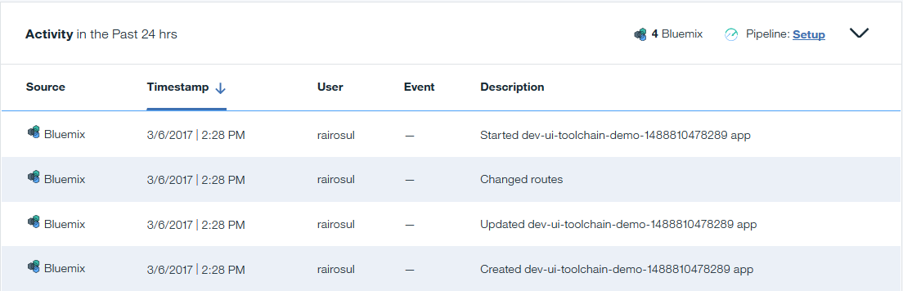

---

copyright:
  years: 2015, 2019
lastupdated: "2019-02-14"

---

{:shortdesc: .shortdesc}
{:new_window: target="_blank"}
{:codeblock: .codeblock}
{:tip: .tip}

# Activity
{: #avmon_activities}

View information for activities in the Activity pane. _Activities_ are actions that occur outside of the user-defined events.
{: shortdesc}

The Activity pane displays information about all activities for your application, such as starting, stopping, and deployment, for the past 24 hours.

{{site.data.keyword.Bluemix_notm}} activities are application events that take place in {{site.data.keyword.Bluemix_notm}}, such as your application stopping, starting, or being restaged. Pipeline activities are events that take place in your DevOps pipeline, such as builds, deployments, and tests. The table header displays separate totals for {{site.data.keyword.Bluemix_notm}} activities and Pipeline activities. You can filter by activity Source to display {{site.data.keyword.Bluemix_notm}} activities or Pipeline activities by clicking {{site.data.keyword.Bluemix_notm}} or Pipeline icons on the Activity pane header.

To view Pipeline activities in the {{site.data.keyword.prf_hubshort}} dashboard, you must first enable {{site.data.keyword.contdelivery_short}} for your application, and configure a toolchain that contains a pipeline and the {{site.data.keyword.DRA_short}} service. Click **Pipeline Setup** to create a toolchain for your application. For more information, see [Getting started with Continuous Delivery](/docs/services/ContinuousDelivery?topic=ContinuousDelivery-cd_getting_started "(Opens in a new tab or window)"){:new_window} and [Getting started with DevOps Insights](/docs/services/DevOpsInsights?topic=DevOpsInsights-getting-started "(Opens in a new tab or window)").
{: tip}

If you have {{site.data.keyword.contdelivery_short}} and {{site.data.keyword.DRA_short}} configured for your application, you can click **View Insights** in the Event column to access the {{site.data.keyword.DRA_short}} dashboards and view further details about your Pipeline activities.

{{site.data.keyword.Bluemix_notm}} and Pipeline activities are also displayed in the **Metric Feed** and on the graph in the Response Time and Availability pane.
