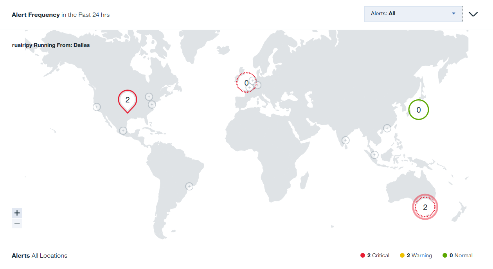
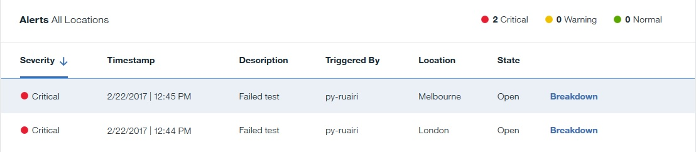

---

copyright:
  years: 2015, 2017
lastupdated: "2017-11-07"

---

{:shortdesc: .shortdesc}
{:new_window: target="_blank"}
{:codeblock: .codeblock}

# Alert Frequency
{: #avmon_alert_freq}

The Alert Frequency panel contains a map that displays the most recent alerts. Alerts are grouped by location, and listed in the Alerts table.
{: shortdesc}

## Alert Frequency map
{: #avmon_alertmap}

The Alert Frequency map displays at-a-glance information for all points of presence (PoPs) for your tests.

Use the zoom function to enlarge any area of the map or restore it to its original size. Hover over each location to view the name of that location, and the number of warning and critical alerts at that location. You can filter the alerts that are displayed on the map by selecting **All**, **Open**, or **Closed** from the **Alerts** drop-down list.

### Host location
The **Host location** icon  represents the location of the server where the application that you are monitoring is running. The color of the **Host location** icon represents the severity of the most recent alert at that location: Normal , Warning , or Critical . An animated **Host location** icon indicates that this location has the most alerts with the highest level of severity out of all locations for your test instances.

### PoP locations
**PoP location** icons  indicate the PoP locations for your tests. The color of each **PoP location** icon represents the severity of the most recent alert at each location: Normal , Warning , or Critical . An animated **PoP location** icon indicates that this location has the most alerts with the highest level of severity out of all locations for your test instances.

Add PoP locations to your selected test by hovering over an **Inactive PoP location** icon  and clicking **Test here**. The Test Edit Mode page is displayed for your selected test. You can select a test from the **Test** drop-down menu on the **Response Time** and **Availability** pane.

<!--
Private PoP locations are represented by **Private PoP location** icons .
-->
### Number of alerts
The **Host location** icon and **PoP location** icons display the number of open, closed, or all alerts that are generated at each location. The Critical, Warning, and Normal icons  display the number of alerts of each severity for your locations.

### Failed tests
Locations where failed test instances occur are indicated by a **Host location** icon or **PoP location** icon with a broken border .

## Alerts table
{: #avmon_alertstable}

The alerts for all locations are displayed in a table.

The table displays the following information about your alerts:

-   **Severity** describes the alert as critical or warning.
-   **Timestamp** shows the time that the alert is created.
-   **Description** summarizes the performance of your test instance.
-   **Triggered By** shows the name of the test that triggered the alert.
-   **Location** states where the problem occurred.
-   **State** shows whether the alert is open or closed.

### Viewing alert details
Each alert in the table contains a link to the **Breakdown** dashboard. Use the Breakdown dashboard to help you to troubleshoot the issue.

### Filtering alerts
To filter alerts for a particular location, click a **Host location** icon or **PoP location** icon on the map. To show alerts for all locations, click anywhere on the map that isn't a **Host location** icon or **PoP location** icon.

To filter the alerts in the table by severity, click the **Critical**, **Warning**, or **Normal** icon . To remove the filter and include alerts of each severity in the table, click the selected icon again.

### Changing alert thresholds
Alerts are triggered by the thresholds that you specify when you create a test. In most cases, they are generated due to availability failures or slow response times. To change the threshold settings, click the **Actions** icon  on the test that generated the alert in the Synthetic Tests pane and click **Edit**.
