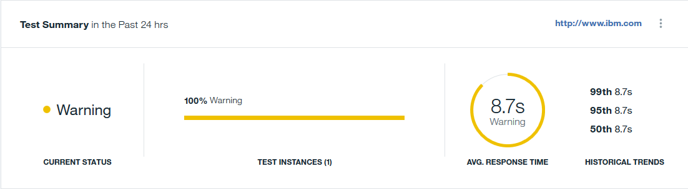
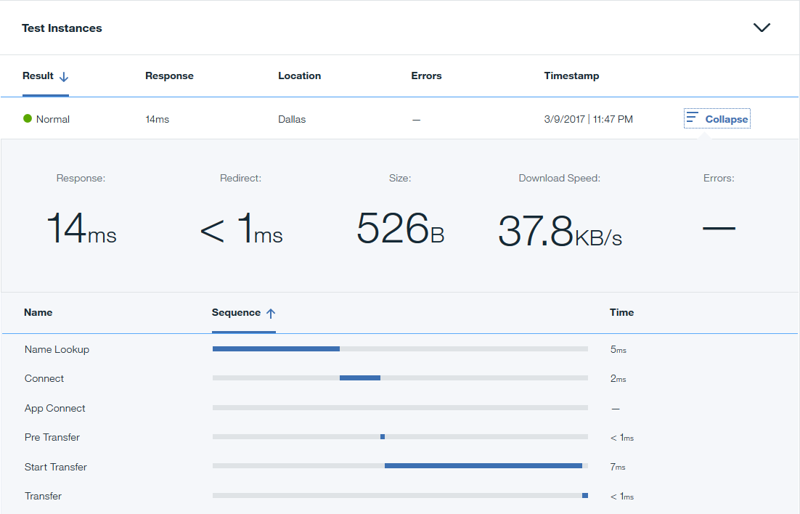
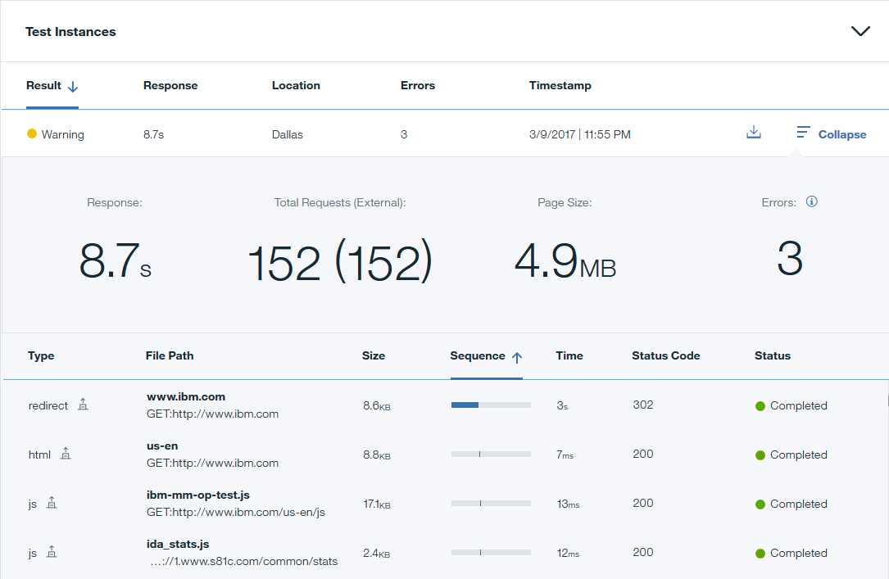
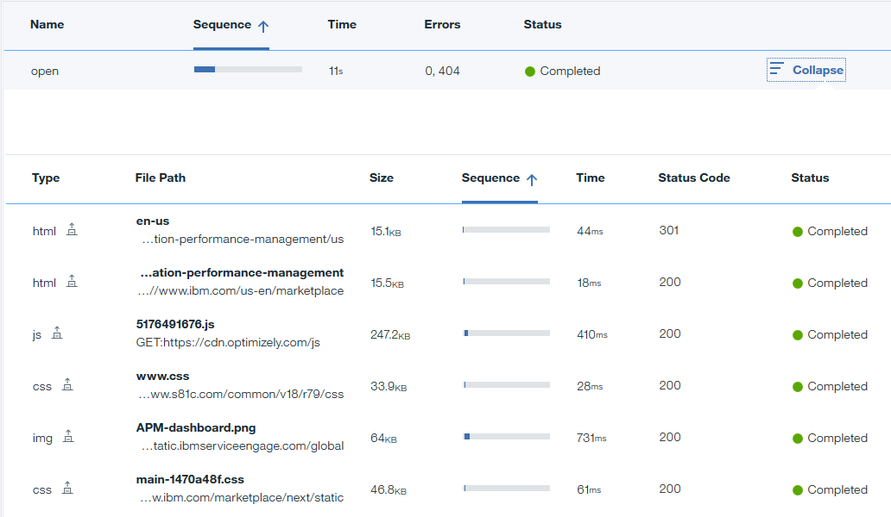

---

copyright:
  years: 2015, 2019
lastupdated: "2019-02-14"

keywords: test dashboard, test instances, historical data, test performance, drill-down

subcollection: availability-monitoring

---

{:shortdesc: .shortdesc}
{:new_window: target="_blank"}
{:codeblock: .codeblock}
{:tip: .tip}

# Breakdown dashboard
{: #avmon_view_breakdown}

The **Breakdown** dashboard displays key statistical information for your tests. The dashboard also summarizes availability and response time information, historical trends, and test performance data over the previous 24 hours.
{: shortdesc}

To view a detailed breakdown of a test, click the test in the Synthetic Tests pane. You can also open the Breakdown dashboard by clicking **Breakdown** in the Alert table in the Alert Frequency pane.

The Breakdown dashboard displays four panes:

## Test Summary
{: #avmon_bdown_summary}

The **Test Summary** pane displays the following test information for the past 24 hours:

-   **Current Status** displays the test status.
-   **Test Instances** displays a percentage breakdown of normal, warning, and critical test instances.
-   **Avg. Response Time** displays the average response time of the test.
-   **Historical Trends** displays the historical trends of your test performance for the 50th, 95th, and 99th percentiles in seconds or milliseconds.

## Test Instances
{: #avmon_bdown_instances}

The **Test Instances** table displays detailed information about each test instance, including the status, response time, location where the test ran, number of errors, and time stamp from when the test ran. To drill down into a test instance, click **Expand**. Detailed response information is listed for each step in the test instance. You can sort any columns to help you to quickly identify the exact step where a slowdown or failure occurred. Viewing the errors, test sequence and response time helps you to identify issues easily.

The information that is displayed depends on the type of Synthetic test that is being monitored:

### API
When you click **Expand** for an API test instance, a high-level summary of the following details is displayed:

-   **Response** displays the total response time for the test instance, including redirect time.
-   **Redirect** displays the total redirect time for the test instance.
-   **Size** displays the size of the object.
-   **Download Speed** displays the speed at which each object downloads.
-   **Errors** displays the number of errors that occurred during the test instance. To view the error details, click the **Information** icon.

A table displays each step in the API call, along with the name of the step, the sequence of steps, and the response time for each step. The following step names are displayed:

-   **Name Lookup** represents the time that the test instance took to resolve the name of the object.
-   **Connect** represents the time that the test instance took from the start of the step until a connection to the remote host or proxy was completed.
-   **App Connect** represents the time that the test instance took from the start of the step until the SSL connection with the remote host was completed.
-   **Pre Transfer** represents the time that the test instance took from the start of the step until just before the file transfer command begins.
-   **Start Transfer** represents the time that the test instance took from the start of the step until the first byte is received.
-   **Transfer** represents the time that the test instance took to transfer the file.

### Webpage

When you click **Expand** for a webpage test instance, a high-level summary of the following details is displayed:

-   **Response** states the response time for the test instance.
-   **Total Requests (External)** displays the total number of requests for the test instance. The number of external requests is in parentheses.
-   **Page Size** displays the size of the web page.
-   **Errors** displays the number of errors that occurred during the test instance. To view the error details, click the Information icon.

A table that lists the following details for each request that is made by the test is also displayed:

-   **Type** displays the type of request, for example, HTML, CSS, JavaScript, or image. External and internal requests are depicted by icons.
-   **File Path** describes the location of the requested object.
-   **Size** displays the size of the requested object.
-   **Sequence** displays the sequence of requests that are made by the test.
-   **Time** displays the time that each request takes.
-   **Status Code** displays the HTTP request status code.
-   **Status** describes the result of the request, for example, Completed, Unknown, or Failed.

### Script

When you click **Expand** for a script test instance, the response time, number of script steps, and number of errors are displayed. To view the error details, click the **Information** icon.

The following details for each script step are displayed in a table:

-   **Name** displays each Selenium command that is called by your test instance, for example Open, ClickAt, or VerifyBodyText.
-   **Sequence** displays the sequence of script steps from the beginning to the end of the test instance.
-   **Time** displays the time that each script step takes.
-   **Errors** displays the number of errors that occurred during each script step.
-   **Status** describes the result of the script step, for example, Completed, Unknown, or Failed.

You can drill down and view details about the requests that are generated by each script step.

Click **Expand** to view a table that contains the following details:

-   **Type** displays the type of request, for example, HTML, CSS, JavaScript, or image. External and internal requests are depicted by icons.
-   **File Path** describes the location of the requested object.
-   **Size** displays the size of the requested object.
-   **Sequence** displays the sequence of requests that are made by the test.
-   **Time** displays the time that each request takes.
-   **Status Code** displays the HTTP request status code.
-   **Status** describes the result of the request, for example, Completed, Unknown, or Failed.

{{site.data.keyword.prf_hubshort}} can automatically create a screen capture if the web page fails to load or a step in the script fails. For example, if one of the steps in your script opens a web page but it does not load, {{site.data.keyword.prf_hubshort}} automatically creates a screen capture. To view a screen capture of the web page or script, click the **Screen Shot Error** icon . This feature is only available for web page and scripted test monitoring. It does not work with REST API monitoring.

You can also download a recording of the network traffic for a particular test instance as a .har file by clicking the **Download** icon . This feature is available for web page and scripted behavior test monitoring.

## Response Time and Availability
{: #avmon_bdown_rt_avail}
The Response Time and Availability pane displays a graph of the measured response times and availability for instances of your test over a defined period. For more information, see [Response Time and Availability](/docs/services/AvailabilityMonitoring?topic=availability-monitoring-avmon_resptime_avail "Use the Response Time and Availability pane to help you to visualize response time, availability trends, alerts, and activities over time. The correlation of metrics, alerts, and activities helps you to easily isolate a specific application change or code deployment when you see an impacted response time.").

## Activity
{: #avmon_bdown_activity}
The Activity pane displays a table of all activities over the past 24 hours. For more information, see [Activity](/docs/services/AvailabilityMonitoring?topic=availability-monitoring-avmon_activities "You can view information for activities in the Activity pane. Activities are actions that occur outside of the user-defined events.").
