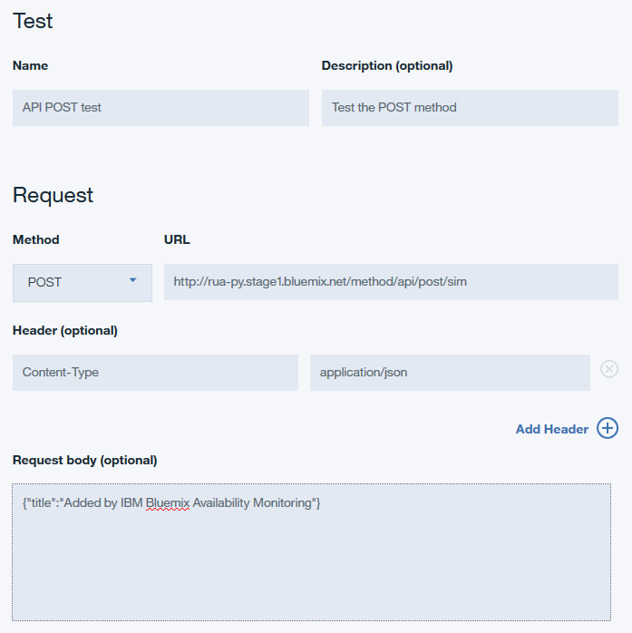
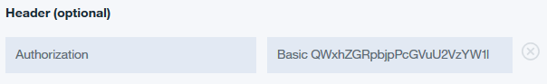
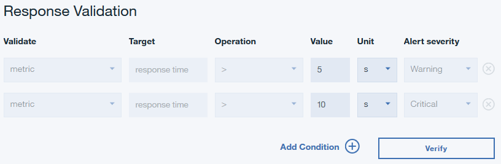
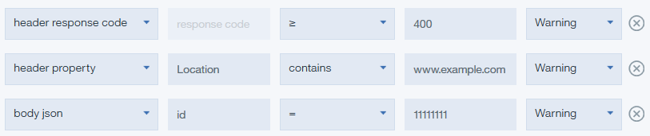
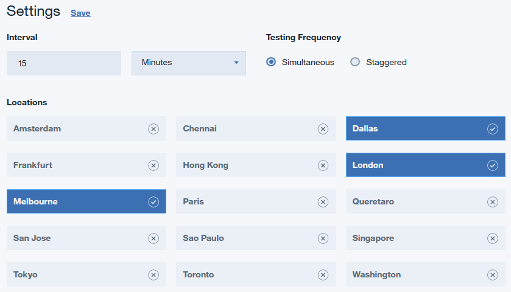

---

copyright:
  years: 2015, 2017
lastupdated: "2017-11-07"

---

{:shortdesc: .shortdesc}
{:new_window: target="_blank"}
{:codeblock: .codeblock}
{:tip: .tip}

# Creating a REST API test
{: #avmon_rest_api}

Create a REST API test to test the response time and availability of your web application by using the following HTTP methods: GET, POST, PUT, and DELETE.
{: shortdesc}

Use REST API tests to monitor the availability and performance of your web application and other URLs in response to REST calls.

To create a REST API test, complete the following steps.

1.  If you are viewing the **Monitoring** Tab for your Cloud Foundry application, click **Add New Test**.

    

    If you are viewing the {{site.data.keyword.prf_hubshort}} dashboard, click **Add New Test** on the Synthetic Tests pane.

    

2.  Click **Single Action** on the Monitoring Setup page; then, click **REST API** on the Single Action page.
3.  Enter a meaningful name for your test in the **Name** field. Add a description of the purpose of your test to the **Description** field.
4.  In the Request section, select the type of method from the **Method** list and enter a **URL** that you want to test with this method. You can choose **GET**, **PUT**, **POST**, or **DELETE**. If you choose the PUT or POST method, you can enter body content to test in the **Request body (optional)** field.

    For example, the following REST API test uses the POST method to request that your web application accepts data in addition to testing the availability and performance of that web application.

    

5.  You can configure your test to include a particular header and value. Enter a header name and header value in the **Header** fields.

    If the web application that you want to test requires a user login and password, enter "Authorization" into the **Header name** field. Enter the word "Basic", a space character, and the base64 encoded value of your username:password into the **Header value** field.

    For example, if your username is Aladdin and your password is OpenSesame, then enter the word "Basic", a space character, and the base64 encoded value for Aladdin:OpenSesame into the **Header value** field.

    

6.  Configure the warning and critical alert thresholds for your test in the Response Validation section. Edit the **Value** and **Unit** for each row. Response times that exceed your warning and critical thresholds trigger alerts.

    

7.  Click **Add Condition** to define and add customized response validation conditions. Customized response validation conditions are evaluated in aggregate to generate an alert. You can define and add up to six customized conditions for your test.

    In {{site.data.keyword.prf_hubshort}}, each test can generate up to a total of three alerts. Your test reports the alert with the highest severity until all conditions that cause alerts are resolved. For more information, see [Alert generation in Availability Monitoring](avmon_alert_desc.html "In Availability Monitoring, tests can generate up to a total of three alerts. Your test reports the alert with the highest severity until the condition causing the alert is resolved.")
    {: tip}

    You can validate the following data:

    - **Header response code**. Select **Header response code** to test for one or for a range of HTTP response codes.
    - **Header property**. Select **Header property** to test for a particular HTTP header field property and value.
    - **Body json**. Select **Body json** to test for a particular property from a JSON body.

      For each condition, enter a property to test for in the **Target** field, and a value to test for in the **Value** field. Select an operator from the **Operation** drop-down menu. Finally, choose an Alert severity of **Warning** or **Critical** for your condition.

    Numerical values that you enter in the **Value** field are treated as numbers and not strings by default. When entering a **Value** for a response validation condition, use quotation marks "" to distinguish between a string and a number. For example, to test for the string 123, enter "123" in the Value field. To check for the number 400, enter 400 without any quotation marks.
    {: tip}

    

8.  Click **Verify** to create your REST API test and to determine whether your test request is valid.

    {{site.data.keyword.prf_hubshort}} determines the test validity by using the selected HTTP method and any request headers that you defined for the test. No response validation takes place during test verification.

    Your validated test is displayed in the Verified Items table. You can add more URLs by repeating steps 3 - 8.

9.  To configure your test settings, click Next.

    A summary of the test configuration is displayed. For example, the following message is displayed for the default settings:

    ``Test will occur: Every 15 minutes from 3 locations simultaneously to determine if test exceeds the specified threshold.``

    The estimated usage and estimated number of tests per month are displayed based on your current test configuration.

10. In the Settings pane, click **Edit** to display the current settings for your test.

    You can change the interval of the tests, the testing frequency, and the locations where the tests are sent from.

    

    Select **Simultaneous** to run your test from all locations simultaneously, or select **Staggered** to run your test from a different selected location at each interval. Click **Save** to finish configuring your test.

11. Click **Finish**. The {{site.data.keyword.prf_hubshort}} dashboard displays a summary of all your tests, a map and table that display the severity and location of your alerts, all synthetic tests that are associated with your application, a table of your activities, and a line graph that depicts the response time and availability of your application and other websites.
