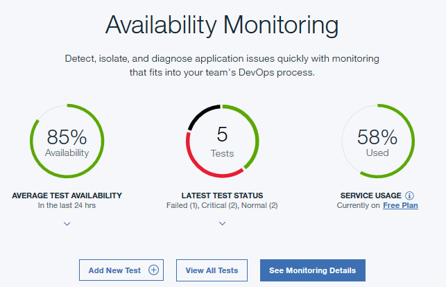
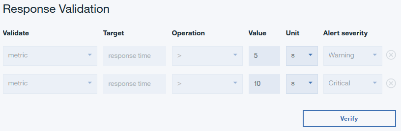

---

copyright:
  years: 2015, 2017
lastupdated: "2017-11-07"

---

{:shortdesc: .shortdesc}
{:new_window: target="_blank"}
{:codeblock: .codeblock}

# Creating a webpage test
{: #avmon_webpage_test}

Create a webpage test to test the availability of your web application and to monitor how long that page takes to open.
{: shortdesc}

## About this task
{: #avmon_webpage_about}

Webpage tests report the response time for loading the URL of your web application. Create a webpage test to monitor the availability and response time of your web application.

## Creating and configuring your webpage test
{: #avmon_create_web_test}

To create a webpage test, complete the following steps.

1.  If you are viewing the Monitoring Tab, click **Add New Test**.

    

    If you are viewing the {{site.data.keyword.prf_hubshort}} dashboard, click **Add New Test** on the Synthetic Tests pane.

    

2.  Click **Single Action** on the Monitoring Setup page; then, click **Webpage** on the Single Action page.
3.  Enter a meaningful name for your test in the **Name** field. Add a description of the purpose of your test to the **Description** field.
4.  Enter the **URL** of the web application that you want to test.
5.  Configure the warning and critical alert thresholds for your test in the Response Validation section. Edit the **Value** and **Unit** for each row. Response times that exceed your warning and critical thresholds trigger alerts.

    

6.  Use the **Blacklist** and **Whitelist** to specify which URLs and domains to send requests to and which URLs and domains contribute to the metrics and status of your application tests. Add URLs and domains that you want to include or block to the **Whitelist** and **Blacklist**. For more information about blocking and filtering, see [Blocking and filtering with the whitelist and blacklist](avmon_whitelist_blacklist.html#avmon_whitelist_blacklist "Use the whitelist and blacklist to determine which resources to send requests to and which resources contribute to the metrics and status of your application tests. Whitelists and blacklists are only available for webpage and scripted behavior tests.").
7.  Click **Verify** to create your webpage test and to determine whether your test request is valid.

    {{site.data.keyword.prf_hubshort}} determines the test validity by sending a GET request to your test URL. No response validation takes place during test verification.

    Your validated test is displayed in the Verified Items table. You can add more URLs by repeating steps 3 - 7.

8.  To configure your test settings, click **Next**. A summary of the test configuration is displayed. For example, the following message is displayed for the default settings:

    ``Test will occur: Every 15 minutes from 3 locations simultaneously to determine if test exceeds the specified threshold``.

    The estimated usage and estimated number of tests per month are displayed based on your current test configuration.

9.  In the Settings pane, click **Edit** to display the current settings for your test. You can update the following settings:
    - **Interval** defines how often the test runs.
    - **Testing frequency** determines whether your test runs from all locations simultaneously or from a different location at each interval. Select **Simultaneous** to run your test from all locations simultaneously, or select **Staggered** to run your test from a different selected location at each interval.
    - **Locations** determines the locations where your test will run.

    Click **Save** to finish configuring your test.

10. Click **Finish**. The {{site.data.keyword.prf_hubshort}} dashboard displays a summary of all your tests, a map and table that display the severity and location of your alerts, all synthetic tests that are associated with your application, a table of your activities, and a line graph that depicts the response time and availability of your application and other websites.
