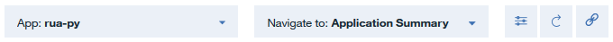
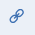

---

copyright:
  years: 2015, 2019
lastupdated: "2018-01-11"

---

{:shortdesc: .shortdesc}
{:new_window: target="_blank"}
{:codeblock: .codeblock}

# The Availability Monitoring dashboard
{: #avmon_viewing_dashboard}

You can view the details of your application's availability and performance, along with alerts and any associated tests on the {{site.data.keyword.prf_hubshort}} dashboard.
{:shortdesc}

The {{site.data.keyword.prf_hubshort}} dashboard is divided into the following panes:

-   Application Summary
-   Alert Frequency
-   Synthetic Tests
-   Activity
-   Response Time and Availability

Use the dashboard header to switch between your applications and navigate between different panes for the displayed application. Select an application from the **App** drop-down menu to switch to the {{site.data.keyword.prf_hubshort}} dashboard for that application. Select a pane from the **Navigate to:** drop-down menu to navigate between panes.

Click the **Configure** icon  to see an overview of your usage, enable team notifications, and set the {{site.data.keyword.prf_hubshort}} dashboard to refresh automatically or manually.

Click the **Refresh** icon to update the information that is displayed on the {{site.data.keyword.prf_hubshort}} dashboard.

Click the **Share** icon  to generate a link to your dashboard that you can then send to other users.

Click the **Help** icon  to open a guided demonstration of each feature on the dashboard.

You can access the **Breakdown** dashboard from the Application Summary pane, the Alert Frequency pane, the Synthetic Tests pane, or the Response Time and Availability pane. The **Breakdown** dashboard displays key statistical information for your test instances.

You can change the order of the panes to suit your needs. To move a pane, click the heading and drag the pane to a different position. To save these changes so that they persist after you log out, click **Save Layout**.
