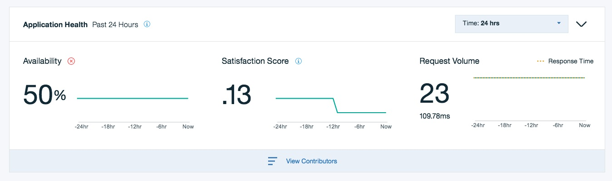
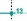
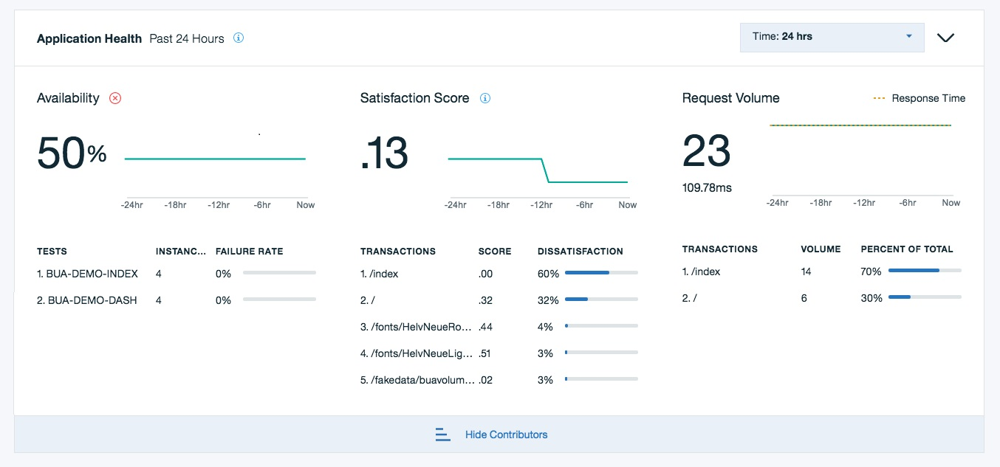
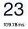

---

copyright:
  years: 2015, 2019
lastupdated: "2019-02-14"

keywords: data collectors, monitoring, requests, user satisfaction, performance

subcollection: availability-monitoring

---

{:shortdesc: .shortdesc}
{:new_window: target="_blank"}
{:codeblock: .codeblock}

# Application Health
{: #avmon_health}

The Application Health pane provides a snapshot of the performance of your application based on the availability of your application, your users satisfaction with the performance of your application, and the throughput of your application.
{: shortdesc}

If {{site.data.keyword.prf_hubshort}} detects that a data collector is configured for your application, the Application Health pane is available for viewing.

**Restriction:** Initially, a data collector is available for Node.js applications only. For more information about configuring the Node.js data collector, see the [Node.js data collector documentation](https://www.npmjs.com/package/ibmapm "(Opens in a new tab or window)"){: new_window}.

The pane displays three metrics; **Availability**, **Satisfaction Score**, and **Request Volume**.

 The calculation of the **Availability** metric is based on simulated user transaction data from your synthetic tests. By contrast, the **Satisfaction Score** and **Request Volume** metrics rely on both real and simulated users transaction data that is provided by data collectors.

The numeric labels show the latest value of each metric. For example, the latest value for **Availability** is . Time-series line graphs depict the performance of your application on each metric over time. You can set the time span of the history graphs by selecting last **24 hours** or last **7 days** in the Time drop-down. As you hover over the line on the graph, the value for each data point is displayed in a tooltip, for example, . When you click a data point on the line graph, the numeric label displays the value for that data point. Click any area outside of the line graphs to reset the numeric labels to their latest values. Hovering or clicking one graph updates the other two graphs on the **Application Health** pane.

Click  to see the top five transactions or tests that contributed to the current health of the application.

## Availability
{: #avmon_health_availability}
**Availability** shows the degree to which your application is operational. Availability is determined by the percentage of your synthetic test instances that passed successfully. For example, if all your synthetic tests ran successfully during the latest interval, the current Availability value for your application is 100%.

You can configure how {{site.data.keyword.prf_hubshort}} calculates Availability from the Monitoring tab by selecting tests for inclusion in the Availability calculation. For more information, see [Accessing Availability Monitoring](/docs/services/AvailabilityMonitoring?topic=availability-monitoring-avmon_tab "You can access the Availability Monitoring dashboard from the **Monitoring** tab. The Monitoring tab for your Cloud Foundry application displays summary information about the availability and status of your tests, and your service subscription details and usage.").

{{site.data.keyword.prf_hubshort}} calculates the percentage of your test instances that are available per hour. Hover over the line on the graph to see the value each hour interval during the past 24 hours or 7 days.

The top five synthetic tests that contributed to the current availability level of your application are shown. The table displays the following information about each of the tests.

-   **Tests** displays the test name that you assigned.
-   **Instances** shows the number of test instances that were run for each test.
-   **Failure rate** displays the percentage of test instances that failed for each test.

## Satisfaction Score
{: #avmon_health_satscore}
The **Satisfaction Score** is an indicator of user satisfaction with the responsiveness of your application. You set a satisfaction threshold (**T**) value for your application. You determine what response time user requests must meet for your users to be satisfied.

User request response times are converted to an index value between 0.0 and 1.0, with 1.0 being a perfect score with all users satisfied. To calculate the satisfaction score, user samples are categorized as:

-   Satisfied - user requests with a response time less than or equal to the satisfaction threshold are considered Satisfied.
-   Tolerated - user requests that fall between Satisfied and Frustrated are considered Tolerated.
-   Frustrated - user requests with a response time greater than 4**T**, or that result in an error, are considered Frustrated.

The satisfaction score is then calculated as the ratio of [satisfied user requests + (tolerating user requests /2)] / [total number of user requests].

{{site.data.keyword.prf_hubshort}} calculates the satisfaction score based on transaction data for each hour interval. Hover over the line on the graph to see the score for each hour interval during the past 24 hours or 7 days.

The table displays the following information about the top five transactions that contributed to the current satisfaction score of your application:

-   **Transactions** displays the user transaction name.
-   **Score** shows the satisfaction score that is calculated for the individual transaction.
-   **Dissatisfaction** shows the contribution of the transaction to current user dissatisfaction levels. If user satisfaction is not optimal, use the **Dissatisfaction** percentage to gauge how much each transaction impacted dissatisfaction levels.

## Request Volume
{: #avmon_health_reqvol}
The Request Volume metric is the current volume of user transaction instances. The metric indicates the actual throughput of your application.

The average transaction response time for your application is also displayed under the label, for example,  and average response time values are plotted on the graph. You can look for correlations between increases in throughput and increased average response times.

Raw request volume data is aggregated and displayed on the graph on an hourly basis. Hover over the line on the graph to see the throughput for your application for each hour interval during the past 24 hours or 7 days.

The table displays the following information about the top five transactions that are contributing the most to the current request volume. If your application is experiencing high volumes of user traffic, use the **Percentage of Total** to gauge how much each transaction is contributing to the overall traffic volume.

-   **Transaction** displays the user transaction name.
-   **Volume** shows the number of transaction instances for each transaction.
-   **Percent of Total** displays the percentage of the total volume of requests.
