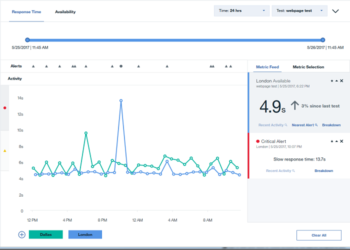
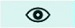
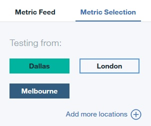
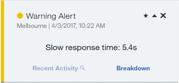
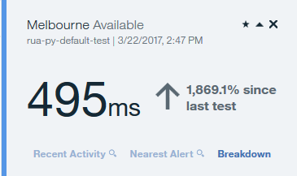
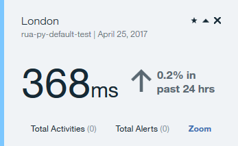
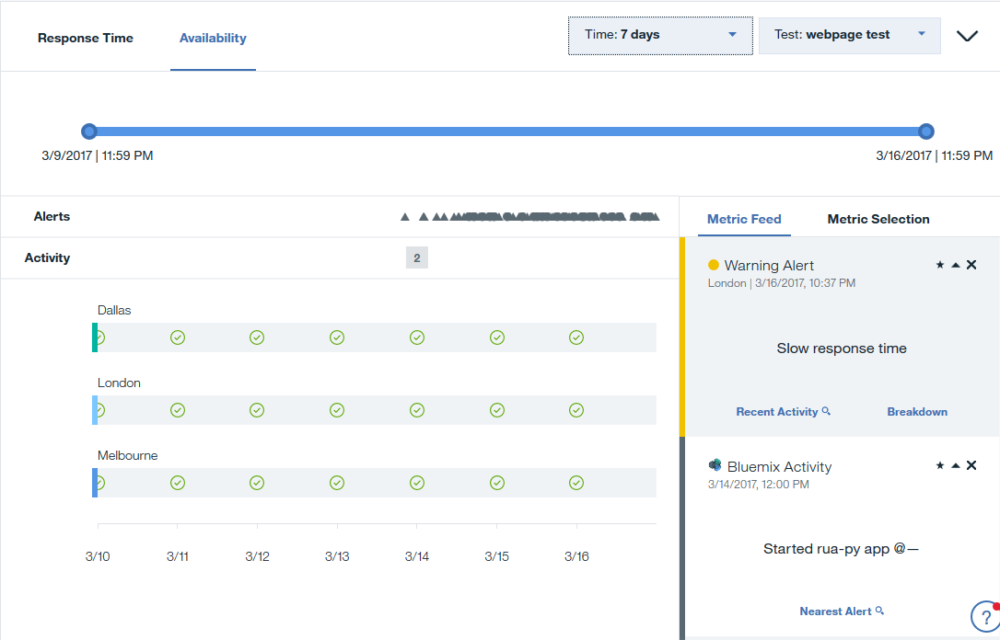
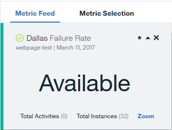

---

copyright:
  years: 2015, 2019
lastupdated: "2019-02-14"

keywords: metric display, view availability, view response, test performance, graphs, test results

subcollection: availability-monitoring
---

{:shortdesc: .shortdesc}
{:new_window: target="_blank"}
{:codeblock: .codeblock}
{:tip: .tip}

# Response Time and Availability
{: #avmon_resptime_avail}

Use the Response Time and Availability pane to help you to visualize response time, availability trends, alerts, and activities over time. The correlation of metrics, alerts, and activities helps you to easily isolate a specific application change or code deployment when you see an impacted response time.
{: shortdesc}

## Response Time
{: #avmon_resptime_graph}

Response time information is displayed on a line graph. To view it, click the **Response Time** tab.

Response times that are measured by {{site.data.keyword.prf_hubshort}} are slightly greater than response times that are experienced by users. {{site.data.keyword.prf_hubshort}} simulates real user behavior, which adds overhead to the response time measurement. The overhead is due to the following factors:
  - {{site.data.keyword.prf_hubshort}} creates a new Firefox instance for each test to prevent previous playbacks from influencing the current test. Real end users might experience faster response times due to browser caching.
  - {{site.data.keyword.prf_hubshort}} installs the Firefox web driver plug-in before each test.
{: tip}

Individual response times for tests are represented by a **Response point** icon  on the line graph. Different colors denote different geographic locations where the application is running. The graph's y-axis uses alert icons to identify the warning and critical threshold ranges. The yellow **warning** icon  represents the warning threshold range, and the red **critical** icon  represents the critical threshold range. Click the yellow **warning** icon  or the red **critical** icon  to identify easily test instances that appear in the warning and critical threshold ranges. To view the details for a specific test instance, click the **Response point** icon  on the graph.

### Filters

Choose a test from the **Test** drop-down menu. You can filter data for 3 hours, 24 hours, 7 days, 30 days, and 12 months. The ability to view data over 12 months is available only to users with paid subscriptions to {{site.data.keyword.prf_hubshort}}. When you filter for a time range greater than 24 hours, the values that are displayed in the graph are averaged. To view more specific information, click the graph to drill down to the individual alerts and warnings. You can also use the slider to narrow or expand the time range.

With the Response Time graph, you can highlight and hide the data from particular PoP locations. To highlight response time data for a particular location, hover over the PoP location name; then, click the **Highlight location** icon . To hide response time data for a location, hover over the PoP location name; then, click the **Hide location** icon . To restore PoP location data to the graph, click **Add more locations**  or the **Metric Selection** tab; then, click the PoP location that you previously removed.

### Alerts and activities

You can easily identify warning and critical alerts in the Alerts row. Hover over an **alert icon**  to identify the severity and timestamp for that alert. Click the an **alert icon** to display details for that alert in the **Metric Feed**.

You can also view activities on the same graph. _Activities_ are actions that occur which are not user-defined events. {{site.data.keyword.Bluemix_notm}} activities are application events that take place in {{site.data.keyword.Bluemix_notm}}, such as your application stopping, starting, or being restaged. Pipeline activities are events that take place in your {{site.data.keyword.contdelivery_short}} toolchain, such as builds, deployments, and tests. Click an activity to display information about that activity in the **Metric Feed**. You can view information about these activities in the Activity pane.

To view Pipeline activities in the {{site.data.keyword.prf_hubshort}} dashboard, you must first enable {{site.data.keyword.contdelivery_short}} for your application, and configure a toolchain that contains a pipeline and the {{site.data.keyword.DRA_short}} service. Click **Pipeline Setup** on the Summary pane or the Activity pane to create a toolchain for your application. For more information, see [Getting started with Continuous Delivery](/docs/services/ContinuousDelivery?topic=ContinuousDelivery-cd_getting_started "(Opens in a new tab or window)"){:new_window} and [Getting started with DevOps Insights](/docs/services/DevOpsInsights?topic=DevOpsInsights-getting-started "(Opens in a new tab or window)"){:new_window}.
{: tip}

If there is more than one activity or alert icon close together on the Alerts and Activity rows, a **number icon** displays the number of alerts or activities at that time. Hover over a **number icon** to display the individual alerts or activities, and click an alert or activity to view information in the **Metric Feed**.

### Metric Selection and Metric Feed

To filter for metrics by geographic region, click **Metric Selection**. Click a location to add or remove metrics that are measured at that location from the graph. Click **Add more locations** to open the Test Edit Mode page and add a PoP location to your selected test.

To view a list of metric details, click **Metric Feed**. The Metric Feed displays a list of the instances where a metric is fulfilled.

Click an **alert icon**, **activity icon**, or **response point**  on the graph to add the details of that metric to the Metric Feed.

If you filter the Response Time graph for a time range greater than 24 hours and click a **response point**, you can see aggregated details for that day in the Metric Feed.

Click **Zoom** to view all response times, activities, and alerts that were generated by test for that day in the Response Time graph.

To view detailed information about an alert or test response time, click **Breakdown** in the Metric Feed. Click **Nearest Alert** to view the nearest alert to that test instance in the Metric Feed, if an alert occurred. To view detailed information about a pipeline activity in the {{site.data.keyword.DRA_short}} service, click **View Insights** in the Metric Feed.

## Availability
{: #avmon_avail_graph}

To view the availability information for your applications, click Availability. The Availability graph shows the daily availability of each point of presence (PoP) for the selected test.

With the Availability graph, you can highlight and hide the data from particular PoP locations. To highlight availability data for a particular location, hover over the **PoP location name**; then, click the **Highlight location** icon . To hide availability data for a location, hover over the **PoP location name**; then, click the **Hide location** icon . To restore PoP location data to the graph, click the **Metric Selection** tab; then, click the PoP location that you previously removed.

Hover over a graph point to display the failure rate and number of test instances for a particular day and location. Click a graph point to display this information in the Metric Feed.

Click **Zoom** to filter the Availability graph and the Response Time graph to display information for the selected day.
