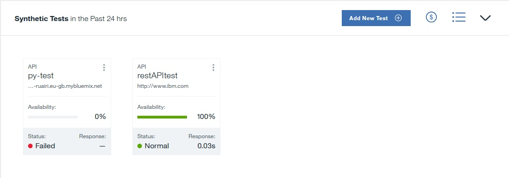

---

copyright:
  years: 2015, 2017
lastupdated: "2017-11-07"

---

{:shortdesc: .shortdesc}
{:new_window: target="_blank"}
{:codeblock: .codeblock}

# Synthetic Tests
{: #avmon_synth_tests}

In the Synthetic Tests pane, you can create, edit, delete, and view synthetic tests that monitor the performance and availability of your applications. Tests are displayed in a list or card view in the Synthetic Tests pane.
{: shortdesc}

Each test card displays information about the test:

- **Availability** displays the percentage availability of the test over the past 24 hours.
- **Status** displays the current status of the test. The status can be Critical, Warning, Normal, Failed, Inactive, or Unknown.
- **Avg. Response** displays the average response time of the test over the past 24 hours.

You can monitor three different types of test:

- **REST API** tests report the response time of a REST call. All HTTP request formats, such as GET, POST, PUT, and DELETE are supported.
- **Webpage** tests report the response time for loading the website at the URL that you enter.
- **Scripted behavior** tests monitor Selenium scripts that you create to mimic a user's interactions with a website. For example, you can create a Selenium script that mimics a user who is logging in to your application. You run this script periodically to test the performance of your application in response to the user actions that are automated by the script. You can upload a script or add a script from a GitHub repository. For more information about creating Selenium scripts, see [Recording synthetic scripts](http://www.ibm.com/support/knowledgecenter/SSMKFH/com.ibm.apmaas.doc/install/admin_syn_record_script.htm "(Opens in a new tab or window)"){: new_window}.

To add another test, click **Add New Test**.

To stop, start, delete, or edit a synthetic test, click the **Actions** icon  and click the action that you want. To view the Breakdown details of the test, click the test.

To view the specific usage of each synthetic test, click the **Cost** icon . If you are subcribed to the paid plan, your usage is displayed in data points.
